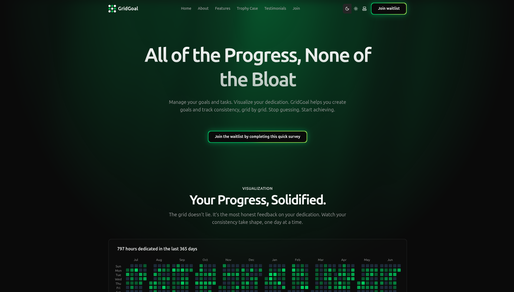

# GridGoal 🎯

**Turn Ambition into Achievement. A Modern, Open-Source Productivity App.**



**[Live Demo](https://gridgoal.xyz)**

GridGoal is a powerful, design-focused productivity tool built to help you structure your ambitions, focus your effort, and reflect on your progress. It combines hierarchical goal planning with a sophisticated focus timer and insightful analytics to create a complete system for achieving what matters most.

---

### ✨ Key Features

- **Hierarchical Goal Planning:** Structure your biggest ambitions into parent goals and smaller, nested sub-goals.
- **Zen Focus Timer:** A full-screen, distraction-free timer with two modes:
  - **Pomodoro:** Work in focused intervals with automated work/break cycles.
  - **Stopwatch:** A simple, flexible timer for any task.
- **Daily Focus Queue:** Curate a prioritized list of tasks for the day to build momentum.
- **Data-Driven Analytics:** Visualize your work with beautiful charts, including:
  - An activity heatmap (like GitHub's contribution graph).
  - Breakdowns of time spent per goal and category.
  - Reports on your planning accuracy and work-life balance.
- **Gamified Achievements:** Unlock a rich set of 20+ awards for consistency, deep work, and planning milestones.
- **Weekly Reset:** A guided flow to celebrate last week's wins and plan for the week ahead.
- **Modern, Responsive UI:** A sleek, beautiful, and fully responsive interface built with the latest web technologies.

### 🚀 Tech Stack

GridGoal is built with a modern, type-safe, and performant technology stack.

- **Framework:** [Next.js](https://nextjs.org/) (App Router)
- **Language:** [TypeScript](https://www.typescriptlang.org/)
- **UI:** [React](https://react.dev/), [Tailwind CSS](https://tailwindcss.com/), [shadcn/ui](https://ui.shadcn.com/)
- **State Management:** [Zustand](https://zustand-demo.pmnd.rs/) (Client State) & [TanStack Query](https://tanstack.com/query) (Server State)
- **Database:** [PostgreSQL](https://www.postgresql.org/)
- **ORM:** [Prisma](https://www.prisma.io/)
- **Authentication:** [NextAuth.js](https://next-auth.js.org/)
- **Animations:** [GSAP](https://gsap.com/) & [Framer Motion](https://www.framer.com/motion/)

### 🛠️ Getting Started: Local Development

Want to run GridGoal on your own machine? Here’s how:

**1. Prerequisites:**

- [Node.js](https://nodejs.org/) (v18 or later)
- [pnpm](https://pnpm.io/) (recommended package manager)
- [PostgreSQL](https://www.postgresql.org/) database running locally or on a service like Supabase.
- A Google account for OAuth authentication.

**2. Clone the Repository:**

```bash
git clone https://github.com/satishkumarsajjan/grid-goal.git
cd grid-goal
```

**3. Install Dependencies:**

```bash
pnpm install
```

**4. Set Up Environment Variables:**
Copy the example environment file and fill in your details.

```bash
cp .env.example .env
```

You will need to fill in the following in your new `.env` file:

- `DATABASE_URL`: Your PostgreSQL connection string.
- `NEXTAUTH_SECRET`: A secret key for NextAuth. Generate one easily by running `openssl rand -base64 32` in your terminal.
- `AUTH_GOOGLE_ID` & `AUTH_GOOGLE_SECRET`: Your Google OAuth credentials. [Get them here](https://console.developers.google.com/).

**5. Set Up the Database:**
Run the Prisma migration to create all the necessary tables in your database.

```bash
npx prisma migrate dev
```

**6. Run the Development Server:**

```bash
pnpm dev
```

Your local instance of GridGoal should now be running at `http://localhost:3000`.

### 🤝 Contributing

We are thrilled you're interested in contributing to GridGoal! This project is open to everyone. We believe in a welcoming and supportive community.

Please read our **[Contributing Guidelines](./CONTRIBUTING.md)** to learn how you can get involved.

### 📄 License

GridGoal is open-source software licensed under the **[MIT License](./LICENSE)**.
